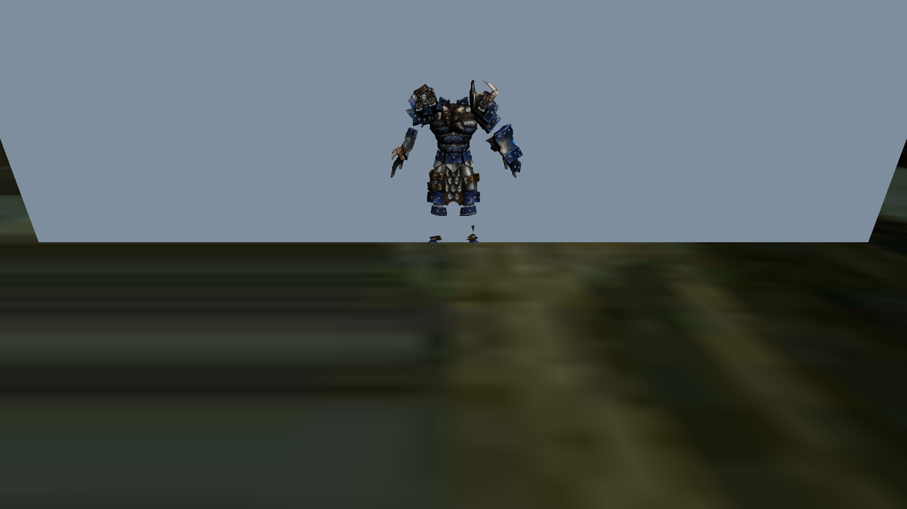
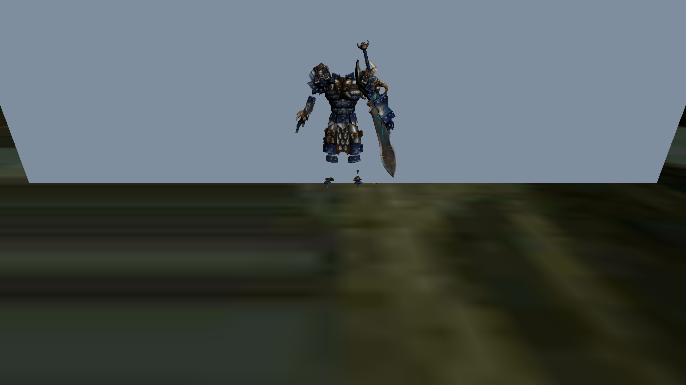
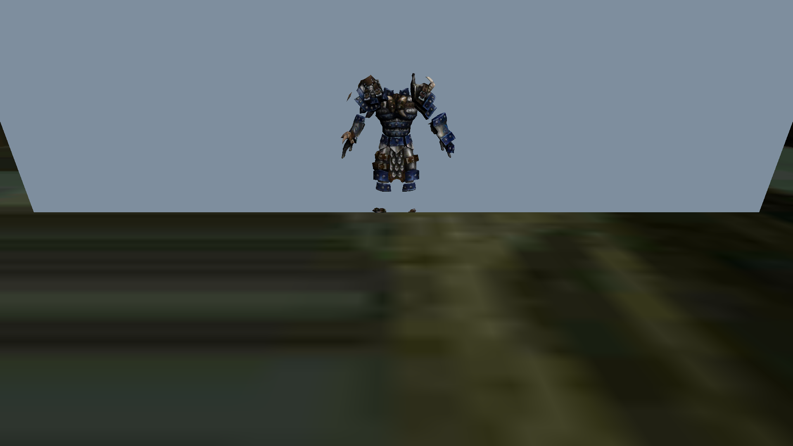
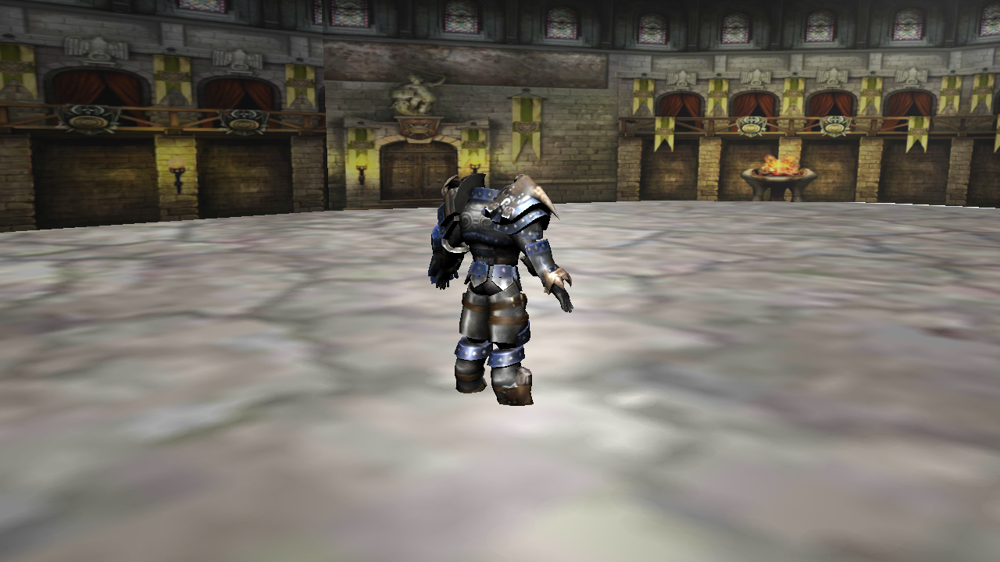
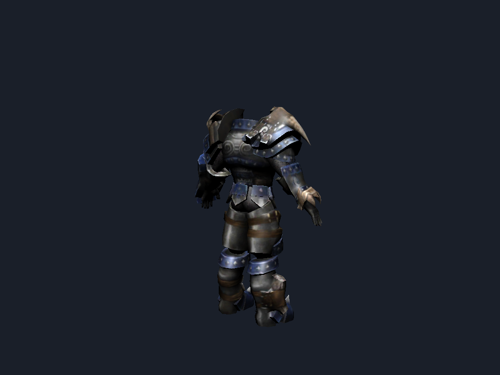

# Juggernaut: Revenge of Sovering — 64-bit (arm64) Unity Port

## Cite this work

**DOI: [10.5281/zenodo.22017430](https://doi.org/10.5281/zenodo.22017430)** (Zenodo, v1.0.1) — concept DOI: 10.5281/zenodo.22017429

Recommended citation:
> Abernathy, R. U. (2026). *Reviving Abandonware with AI-Assisted Porting: The Juggernaut: Revenge of Sovering ARM64 Case Study* (v1.0.1). Zenodo. https://doi.org/10.5281/zenodo.22017430

Decompiled (2026-07-17) and lifted into a **Unity 2021.3.45f1** project targeting
**Android arm64-v8a + IL2CPP**, so it runs on 64-bit-only devices (Pixel 10 Pro,
Android 16). Public repo — the game itself is a proprietary MY.GAMES title;
the code here is for personal/archival/educational use. The whitepaper
(`WHITEPAPER.md`) documents the full porting methodology and is freely citable —
see `CITATION.cff`.

---

## What's in this repo (all automated work done)
- `Assets/Scripts/` — 689 decompiled `.cs` files, **all Unity 4.x→2021 API fixes applied**
  (73 sites: 18 mechanical + 55 semantic; zero `GetComponent("string")` leftovers)
- `Assets/GameData/` — reassembled original Unity 4.x asset containers
  (`sharedassets0.assets`, `mainData`, `unity default resources`) — see caveats
- `ProjectSettings/` — ARM64 (arm64-v8a) ONLY + IL2CPP + minSdk 22, pre-set
- `Packages/manifest.json`, `Assets/Plugins/Android/AndroidManifest.xml`
- `extract_assets.sh` — reassembles the asset containers (already run)
- `ASSETS_SETUP.md` — the one remaining manual bridge (asset format)
- `LOCAL_BUILD.md` — **START HERE**: full local build walkthrough

---

## Screenshots

> Real renders from the port: character meshes and arena geometry extracted from
> the original Unity 4.x OBB bundles (via UnityPy) and re-imported at bind pose.
> Editor shots are 1280×720 renders; battle shots are captured live from the
> Android emulator running the ARM64 IL2CPP build.

| | |
|---|---|
| **Main menu** | **Battle — two warriors** |
|  |  |
| **Battle — ice arena (emulator)** | **Colosseum arena (editor render)** |
|  |  |
| **Character showcase (editor render)** | |
|  | |

---

## Build it — local (recommended)

GameCI's free-license activation is deprecated, so the CI route is blocked.
Build locally instead — it's actually simpler. Full steps in **`LOCAL_BUILD.md`**:

1. Install **Unity Hub** → add **Unity 2021.3.45f1** with **Android Build Support**
   (includes SDK/NDK/JDK).
2. Open this repo folder as a project.
3. File → Build Settings → Android → set **Scripting Backend = IL2CPP**,
   **Target Architectures = ARM64 only** (already pre-set in ProjectSettings) → Build.
4. `adb install build/Juggernaut.apk` on the Pixel 10 Pro.

---

## Build it — CI (fallback, needs a real license file)

`.github/workflows/android.yml` runs GameCI `unity-builder@v4`. It needs a
**`UNITY_LICENSE`** secret containing a valid Unity `.ulf` license (exported from
Unity Hub on a machine you control) **plus** `UNITY_EMAIL` / `UNITY_PASSWORD`.
GameCI can no longer auto-activate free personal licenses, so the license file
must be supplied manually. Optional `ANDROID_KEYSTORE_*` secrets sign the APK.

---

## Honest status / risks
- ✅ Code fully ported & pre-fixed. ✅ Build config ready. ✅ Assets extracted.
- ⚠️ Unity 4.x→2021 **asset format** is the only real unknown — may need a manual
  bridge (UABE / re-save). Cannot be validated headless (no Unity Editor here).
  See `ASSETS_SETUP.md`.
- ⚠️ First compile may surface a few decompile-artifact issues (type-name casing,
  any `WWW` usage). Normal — quick to clear in the Editor log.
- ⚠️ Proprietary game title — the ported code/assets are archival reference only,
  not redistributable. The whitepaper (`WHITEPAPER.md`) is the shareable,
  citable artifact.
